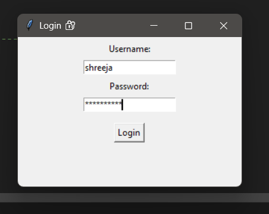

# 📝 To-Do List App (Python + Tkinter)

A simple yet powerful desktop To-Do List application built using **Python** and **Tkinter**, featuring:

✅ Login system  
🌗 Light/Dark Mode toggle  
🔔 Due date reminders  
✏️ Add, Edit, Delete, and Complete tasks  
💾 JSON file storage for persistence  

---

## 📸 Screenshots

| Login Page | Main App (Light Mode) | Dark Mode |  Reminder  |
|------------|------------------------|-----------|-------------|
|  |  |  | |

---

## 🚀 Features

- **User Login**
  - Simple hardcoded login screen (username: `admin`, password: `pass123`)
  
- **Task Management**
  - Add, edit, delete tasks
  - Mark tasks as completed
  - JSON-based task saving
  
- **Due Date Reminders**
  - Reminds about tasks due today or overdue at startup

- **Dark Mode**
  - Toggle between light and dark themes

---

## 💻 Technologies Used

- Python 3.x
- Tkinter (GUI)
- JSON (File storage)
- datetime (for due date reminders)

---

## 🔧 Getting Started

### ✅ Requirements

- Python 3.10+ installed
     
### 🔐 Login Details
- Username: shreeja
- Password: welcome123

### 📜 License
- This project is open-source and free to use under the MIT License.

### 📥 Installation
```bash
git clone https://github.com/yourusername/todo-list-gui.git
cd todo-list-gui
python todo_gui.py